# Manual do Gestor - Uso do Sistema

Este material foi feito para quem vai receber o login e usar o sistema para cuidar da operacao do negocio.
Nao e um guia tecnico.
A ideia aqui e mostrar, de forma simples, o que cada area do sistema faz, quando usar e como uma decisao impacta a outra.

---

## Antes de comecar

Ao entrar no sistema, pense nele como um painel de gestao da sua arena ou escola.
Ele ajuda voce a controlar cinco partes principais do negocio:

- organizacao da estrutura
- cadastro de alunos e professores
- agenda das aulas e reservas
- cobranca e pagamentos
- comunicacao com clientes e alunos

Se voce entender essas cinco partes, o sistema fica facil de usar no dia a dia.

---

## 1. Dashboard

### Para que serve
O Dashboard e a tela para abrir todo dia.
Ele mostra um resumo rapido do negocio e ajuda voce a entender onde precisa agir primeiro.

### O que voce acompanha aqui
- quantidade de alunos
- quantidade de turmas ativas
- receita geral
- day use do dia
- proximas aulas
- proximas reservas

### Quando usar
- no inicio da manha
- antes de abrir atendimento
- sempre que quiser uma visao geral rapida

### O que essa tela influencia
O Dashboard nao altera nada sozinho, mas mostra para onde voce deve ir em seguida.
Normalmente ele leva para:
- `Agendamentos`
- `Presenca`
- `Faturas`
- `Aulas Teste`

Imagem: Dashboard

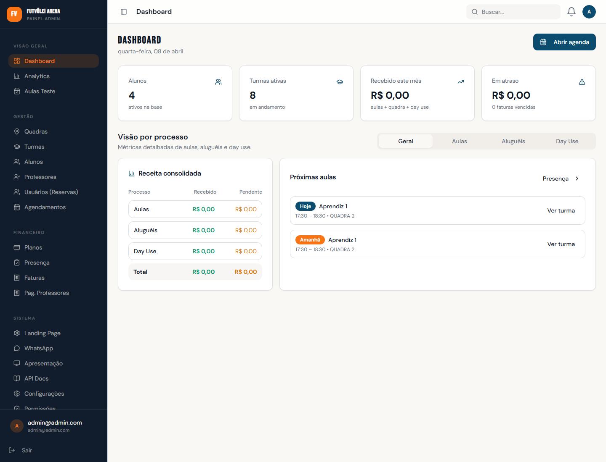

---

## 2. Configuracoes do negocio

### Para que serve
Essa area guarda as informacoes basicas que o sistema usa em varios lugares.

### O que configurar aqui
- nome da empresa
- logo
- link do app
- preco do aluguel de quadra
- preco do day use
- percentual do sinal da reserva

### Regra de negocio importante
Se os valores aqui estiverem errados, o restante da operacao pode ficar errado tambem.
Por exemplo:
- reserva pode sair com preco incorreto
- mensagens podem usar link errado
- day use pode aparecer com valor desatualizado

### Quando usar
- na implantacao inicial
- sempre que mudar preco ou identidade da empresa
- quando o link do sistema mudar

Imagem: Identidade da empresa

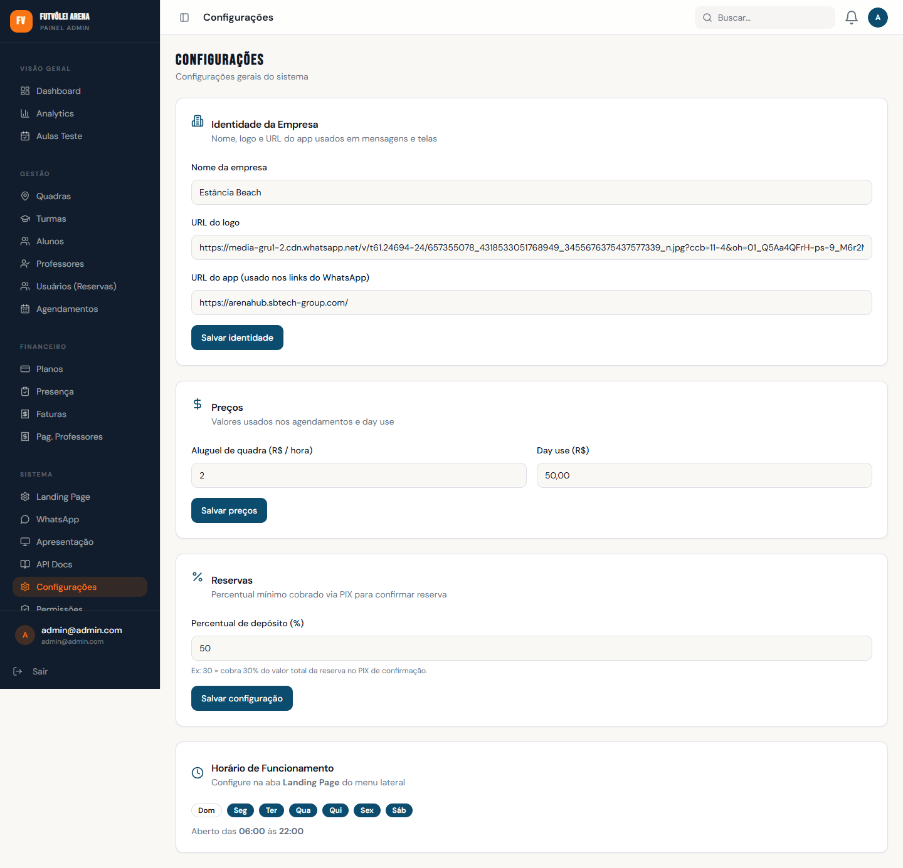

Imagem: Precos

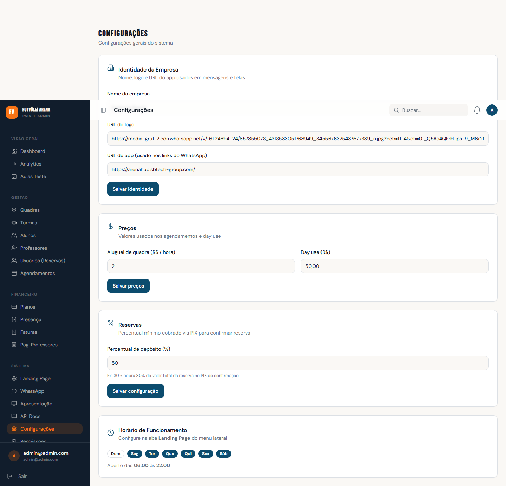

---

## 3. Landing Page

### Para que serve
E a parte publica do negocio.
Em outras palavras: e a vitrine digital da arena ou escola.

### O que voce controla aqui
- imagem principal
- texto do botao principal
- link do botao principal
- redes sociais
- modo do negocio: aulas, reservas ou os dois
- horario de funcionamento

### Regra de negocio importante
A Landing Page influencia a forma como novos interessados chegam no negocio.
Se ela estiver desatualizada, voce pode atrair pessoas para um servico que nem esta mais sendo vendido.

### Quando usar
- quando mudar servicos, preco, campanha ou posicionamento
- quando quiser atualizar a forma de captar clientes

Imagem: Landing Page

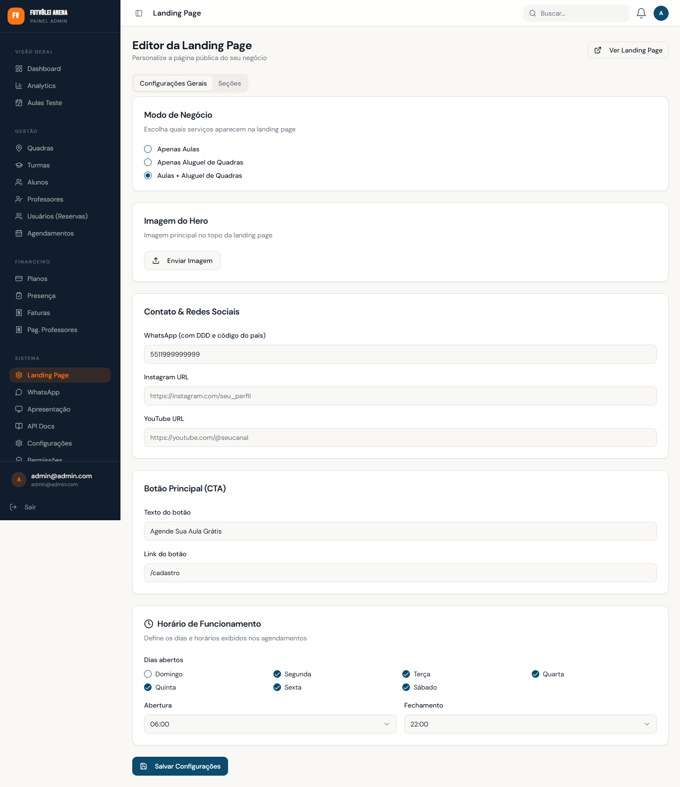

---

## 4. Quadras

### Para que serve
Aqui voce cadastra os espacos fisicos que o sistema vai administrar.

### O que voce faz aqui
- criar quadras
- ativar ou desativar quadras
- organizar nome e identificacao de cada espaco

### Regra de negocio importante
Sem quadras cadastradas, voce nao consegue organizar direito:
- turmas
- agenda
- reservas
- ocupacao da operacao

### Quando usar
- na configuracao inicial
- quando abrir, fechar ou renomear uma quadra

Imagem: Lista de quadras

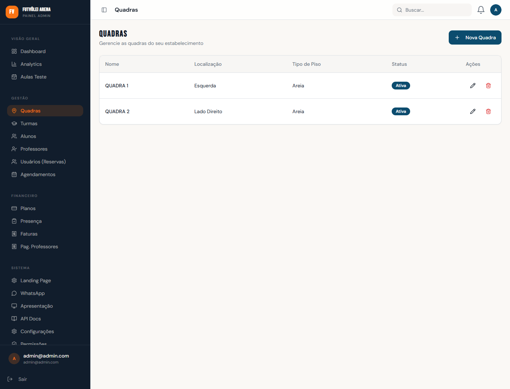

Imagem: Cadastro de quadra

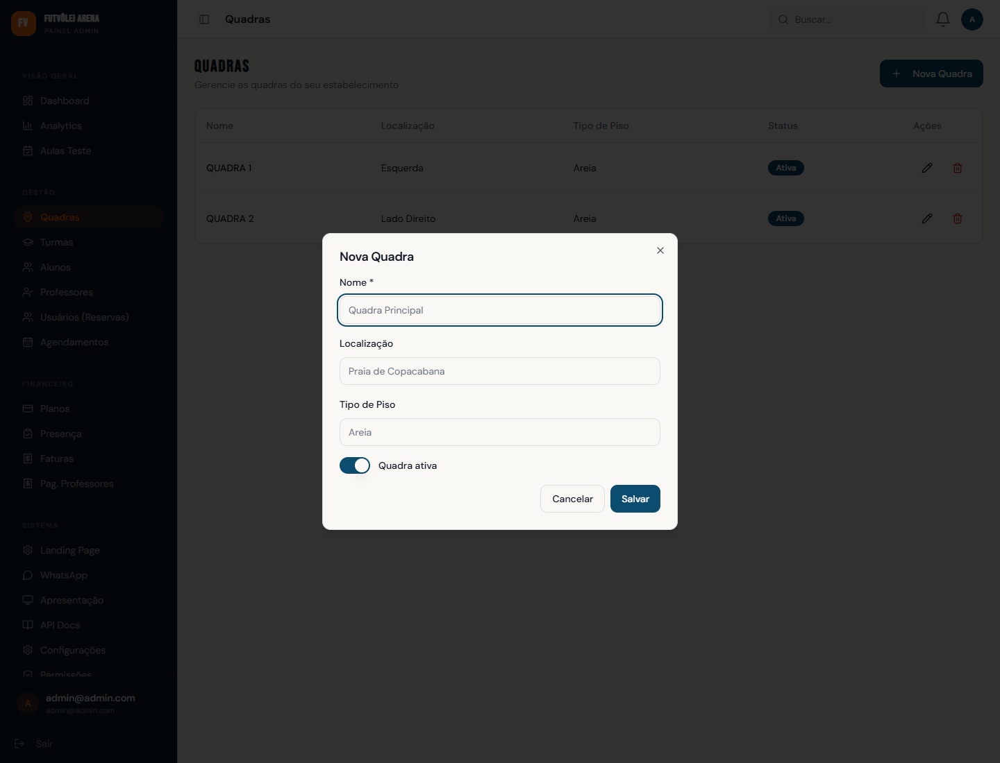

---

## 5. Professores

### Para que serve
Aqui voce controla quem da aula no negocio.

### O que voce faz aqui
- cadastrar professores
- atualizar telefone e dados
- definir valor por aula

### Regra de negocio importante
O valor por aula cadastrado aqui impacta os pagamentos do professor depois.
Entao essa informacao precisa estar correta.

### Quando usar
- quando um professor entra
- quando mudar valor por aula
- quando precisar atualizar cadastro

Imagem: Lista de professores

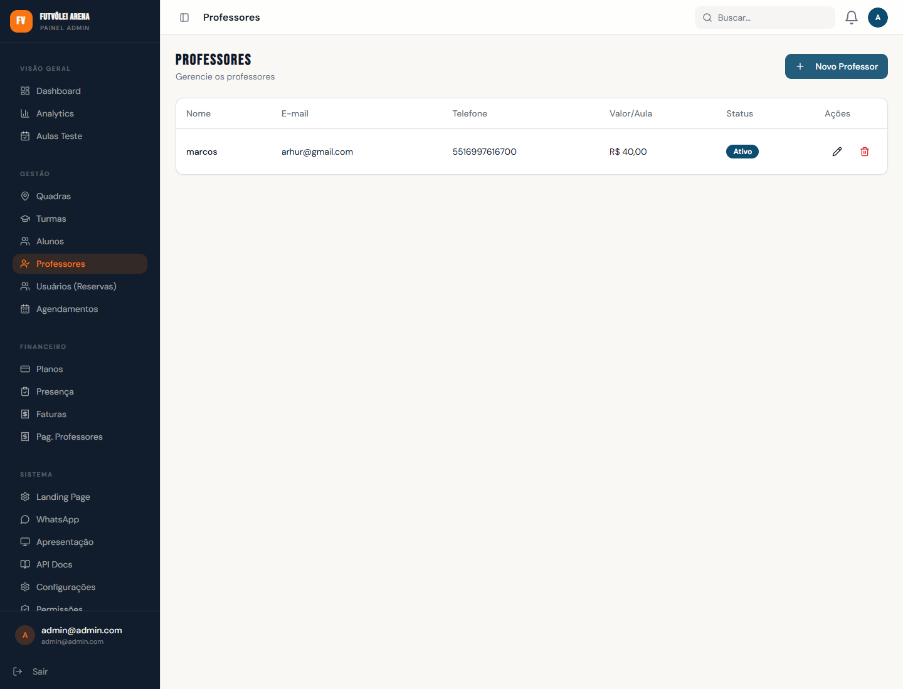

Imagem: Cadastro de professor

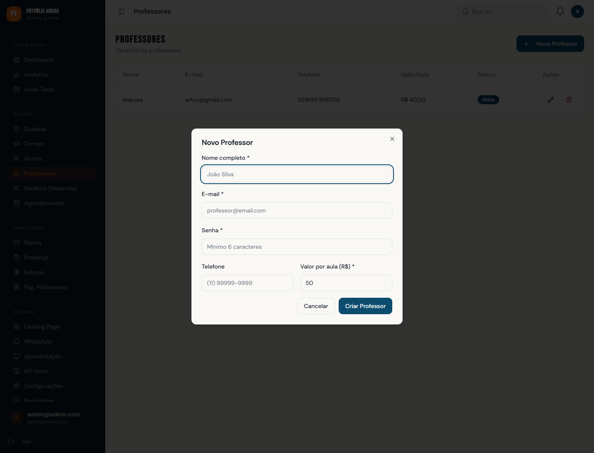

---

## 6. Planos

### Para que serve
Os planos representam a forma como voce vende a mensalidade para os alunos.

### O que voce define aqui
- nome do plano
- quantidade de aulas por semana
- valor mensal
- se o plano esta ativo ou nao

### Regra de negocio importante
O plano afeta diretamente:
- o cadastro do aluno
- a geracao de faturas
- a jornada do aluno dentro do sistema

Se o plano estiver errado, a cobranca tambem pode ficar errada.

### Quando usar
- quando criar ou mudar um plano comercial
- quando deixar de vender um plano antigo

Imagem: Lista de planos

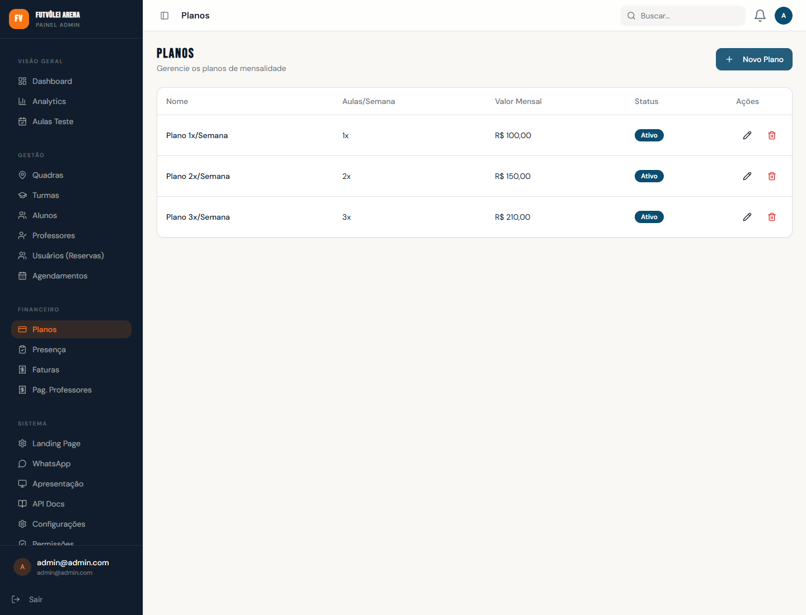

Imagem: Cadastro de plano

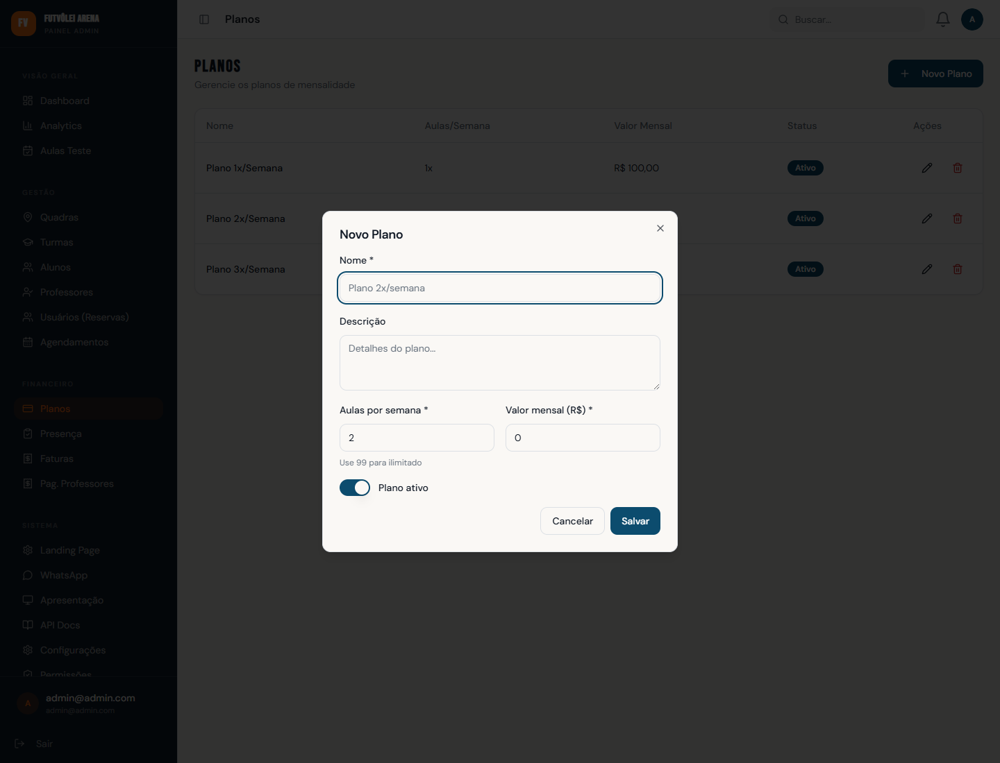

---

## 7. Turmas

### Para que serve
As turmas organizam a operacao das aulas.
Elas ligam professor, quadra, horario e alunos.

### O que voce faz aqui
- criar turmas
- definir dias e horarios
- escolher a quadra
- escolher o professor
- definir limite de alunos
- acompanhar lotacao

### Regra de negocio importante
A turma e o centro da operacao das aulas.
Ela impacta:
- presenca
- agenda
- matriculas
- comunicacao com os alunos

Se uma turma estiver com horario, professor ou quadra errados, esse erro aparece em varias partes do sistema.

### Quando usar
- ao montar a grade de aulas
- quando abrir nova turma
- quando mudar professor, horario ou lotacao

Imagem: Lista de turmas

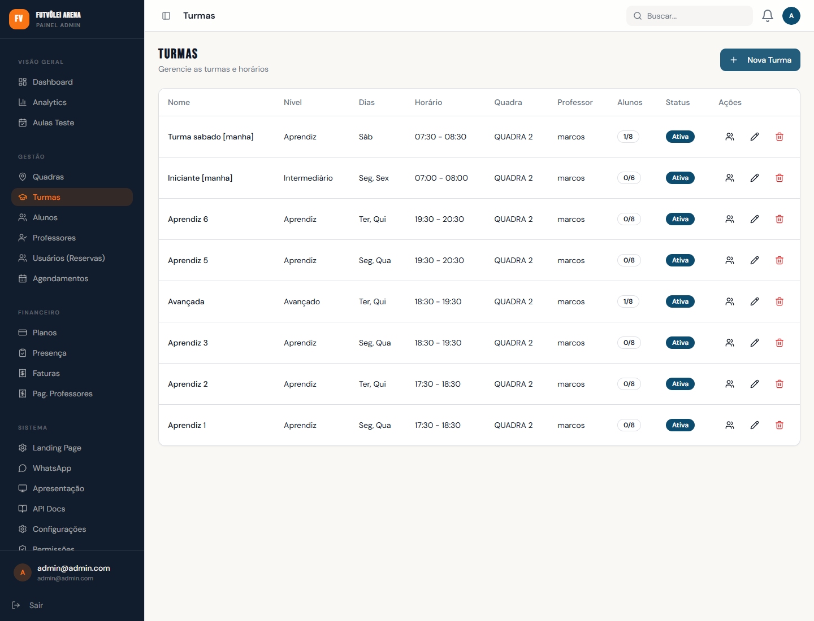

Imagem: Cadastro de turma

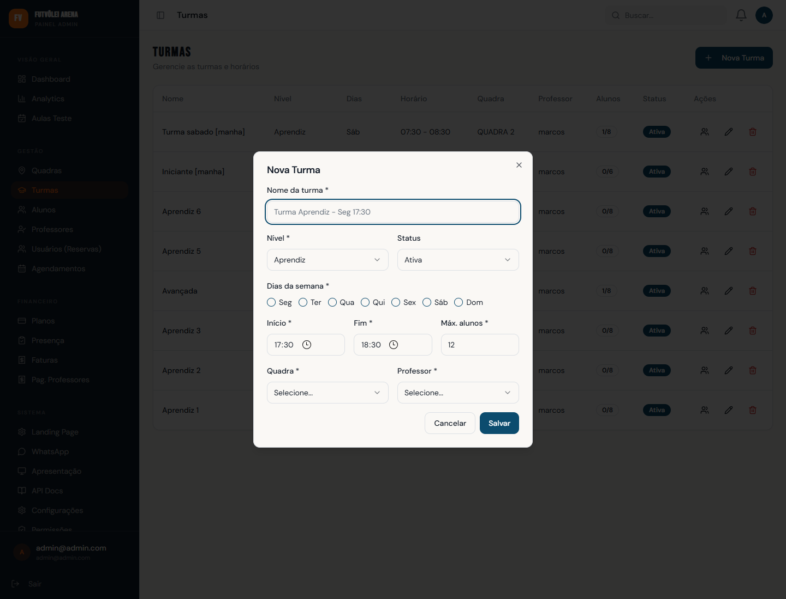

---

## 8. Alunos

### Para que serve
Essa area organiza a base de clientes que fazem aula com voce.

### O que voce faz aqui
- cadastrar novo aluno
- atualizar dados
- definir nivel
- vincular plano
- matricular em turma

### Regra de negocio importante
Quando voce cadastra um aluno, tres areas passam a se conectar:
- aulas
- financeiro
- comunicacao

Por isso, o cadastro precisa estar completo, principalmente:
- nome
- telefone
- plano
- turma

### Quando usar
- na entrada de um novo aluno
- quando houver mudanca de plano ou turma
- quando precisar corrigir dados

Imagem: Lista de alunos

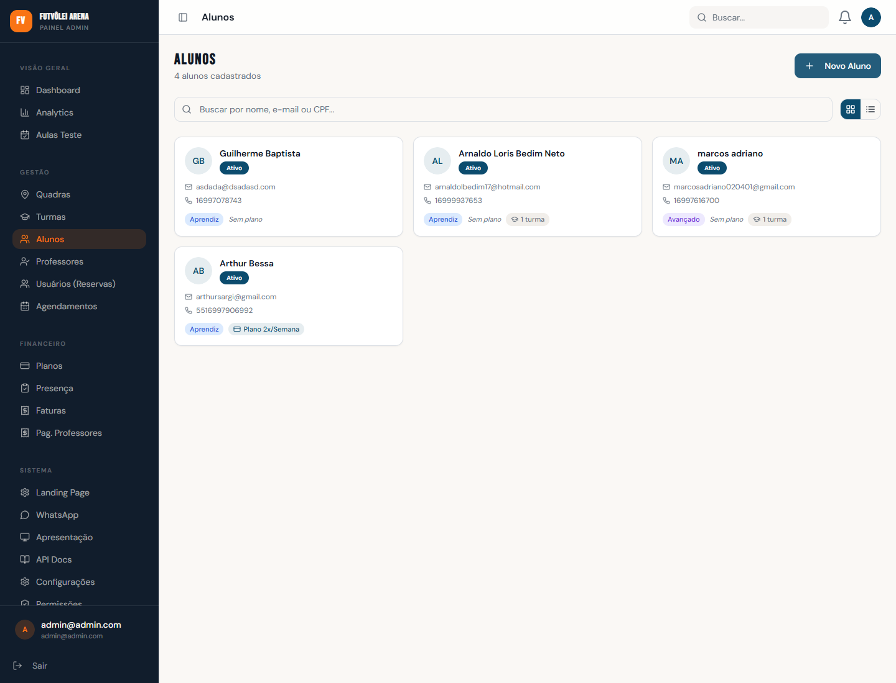

Imagem: Cadastro de aluno

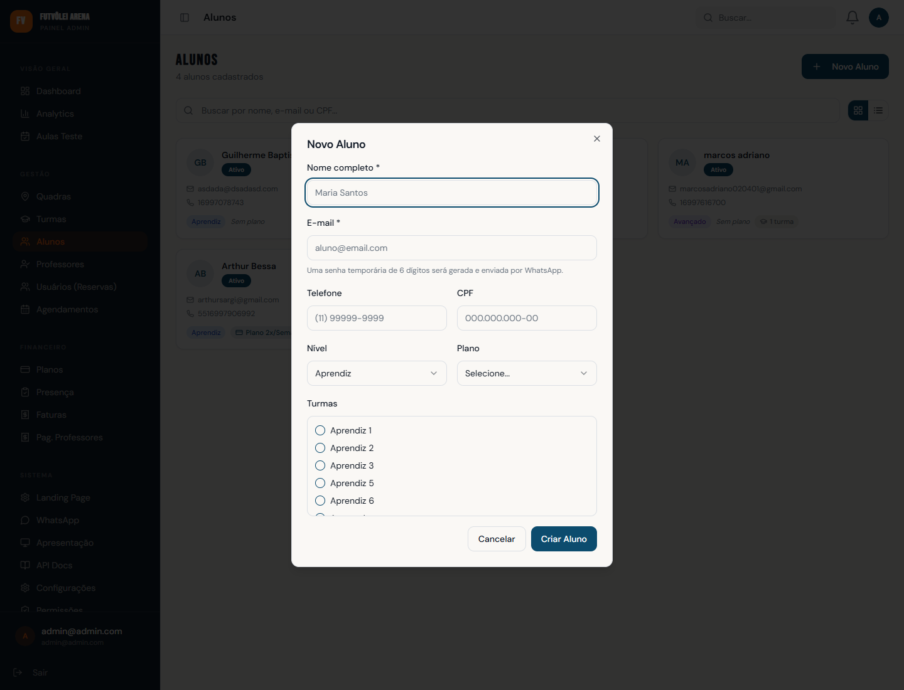

---

## 9. Aulas Teste

### Para que serve
Essa tela ajuda a transformar interessados em alunos pagantes.

### O que voce faz aqui
- ver pedidos de aula teste
- aprovar ou rejeitar
- confirmar comparecimento
- marcar se a aula foi realizada
- usar o WhatsApp para dar continuidade no atendimento

### Regra de negocio importante
Aula teste nao e so agenda. Ela faz parte do processo comercial.
O ideal e acompanhar sempre, porque cada pedido parado significa uma oportunidade perdida.

### Quando usar
- todos os dias
- principalmente no inicio e no fim do expediente

Imagem: Solicitacao pendente

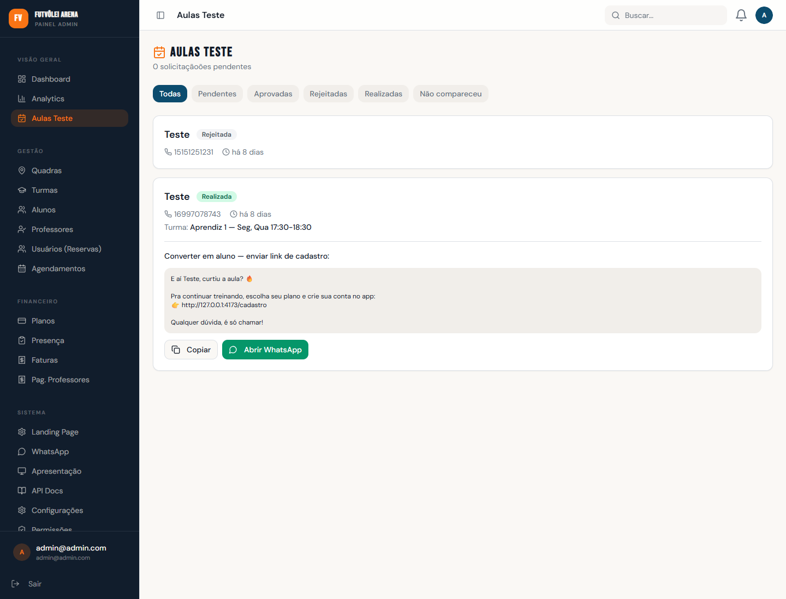

Imagem: Solicitacao aprovada

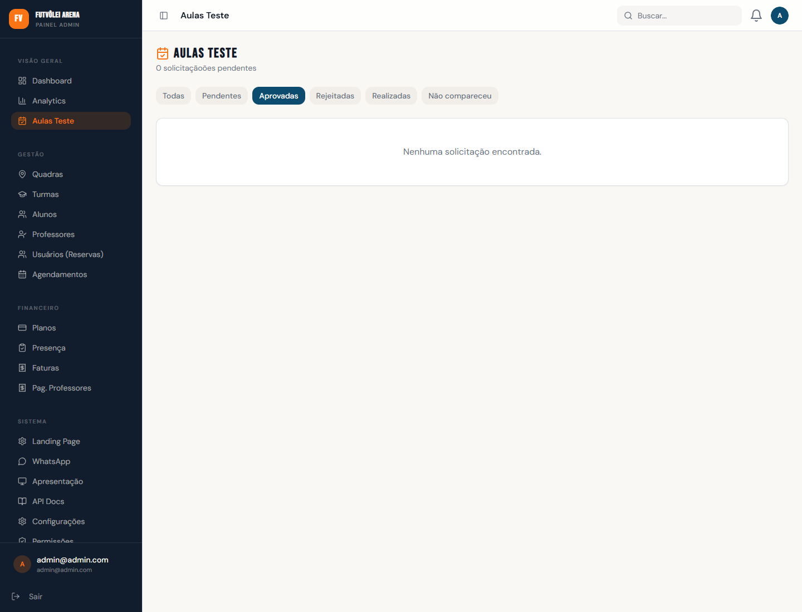

---

## 10. Agendamentos

### Para que serve
Essa tela controla o uso real da estrutura: aulas, reservas e day use.

### O que voce faz aqui
- ver a agenda semanal
- ver a agenda por quadra
- identificar horarios livres e ocupados
- confirmar reservas
- acompanhar reservas pagas

### Regra de negocio importante
Essa tela ajuda a evitar conflito operacional.
Ela mostra tudo o que esta ocupando a quadra, entao deve ser consultada com frequencia.

### Quando usar
- varias vezes ao dia
- antes de confirmar reservas
- para planejar ocupacao e encaixes

Imagem: Visao semanal

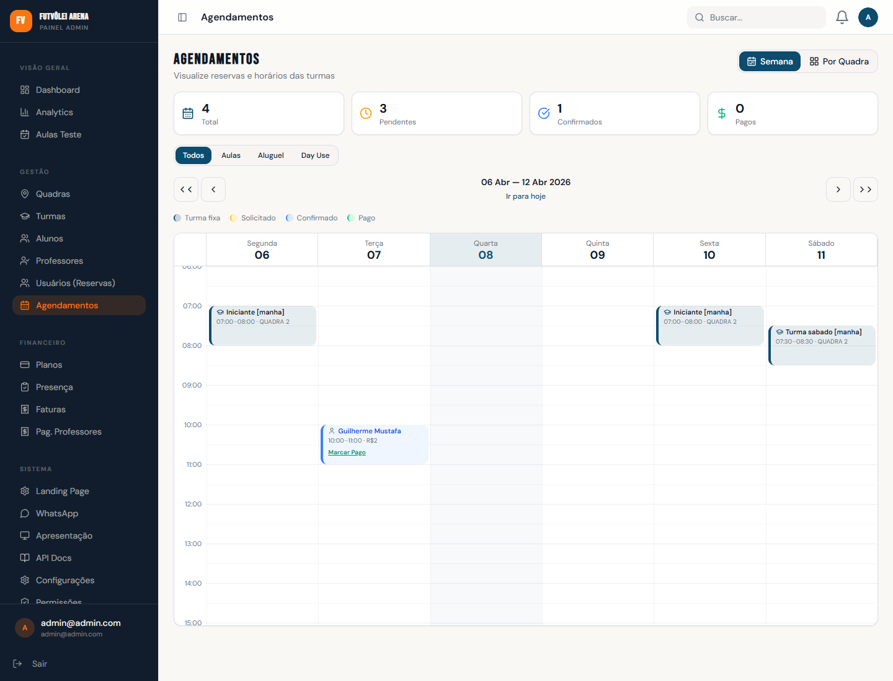

Imagem: Visao por quadra

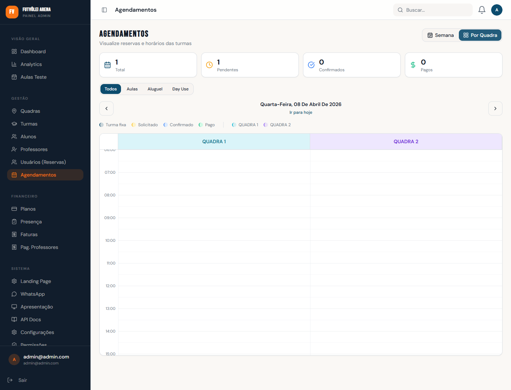

---

## 11. Presenca

### Para que serve
Ajuda voce a acompanhar a rotina das aulas e o compromisso dos alunos com a turma.

### O que voce faz aqui
- gerar sessoes futuras
- ver aulas agendadas
- acompanhar confirmados, presentes e ausentes

### Regra de negocio importante
A presenca e um sinal de saude da turma.
Quando a frequencia comeca a cair, normalmente aparece um problema de engajamento, horario, nivel da turma ou risco de cancelamento.

### Quando usar
- durante a semana
- no acompanhamento de turmas ativas
- para apoiar decisao de gestao

Imagem: Presenca

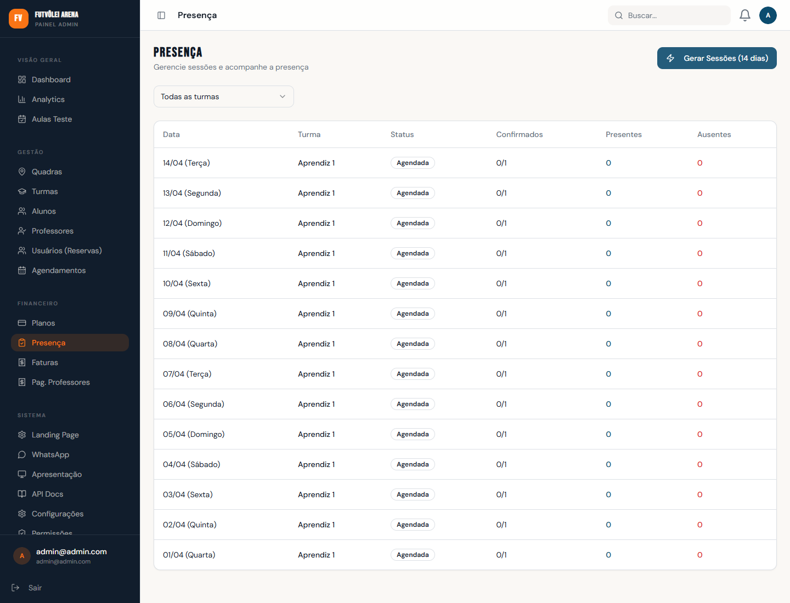

---

## 12. Faturas

### Para que serve
E a area de cobranca dos alunos.

### O que voce faz aqui
- ver faturas pendentes, pagas e vencidas
- criar cobranca manual
- gerar faturas em lote
- marcar pagamento

### Regra de negocio importante
Essa tela representa o dinheiro que entra no negocio.
Se voce nao acompanha essa parte com frequencia, a inadimplencia cresce sem perceber.

### Quando usar
- no inicio do mes, para gerar cobrancas
- ao longo do mes, para acompanhar recebimentos
- sempre que precisar confirmar pagamento

Imagem: Lista de faturas

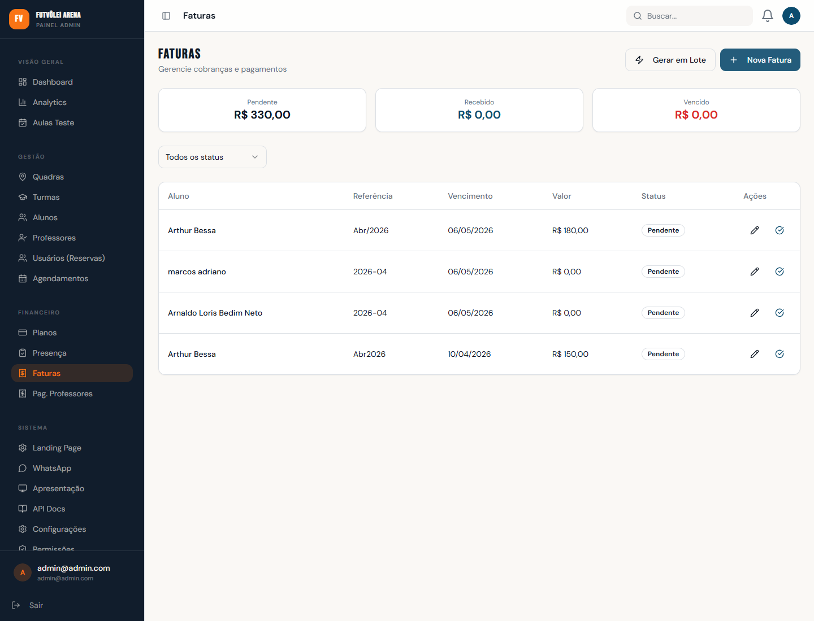

Imagem: Geracao em lote

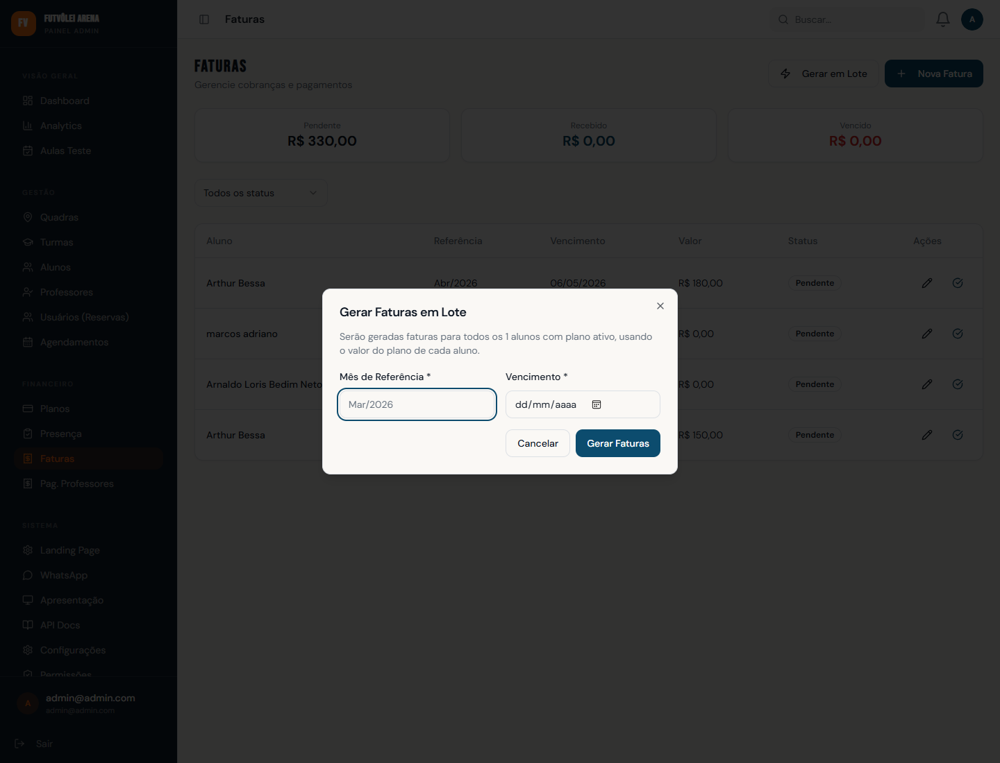

---

## 13. Pagamentos de Professores

### Para que serve
Mostra o que deve ser pago para os professores conforme a operacao do periodo.

### O que voce faz aqui
- filtrar por mes
- ver total por professor
- marcar pagamento realizado

### Regra de negocio importante
Essa tela ajuda no fechamento financeiro e evita erro no repasse.
O ideal e revisar sempre junto com a realidade da operacao do mes.

### Quando usar
- no fechamento mensal
- na preparacao de pagamentos

Imagem: Pagamentos de professores

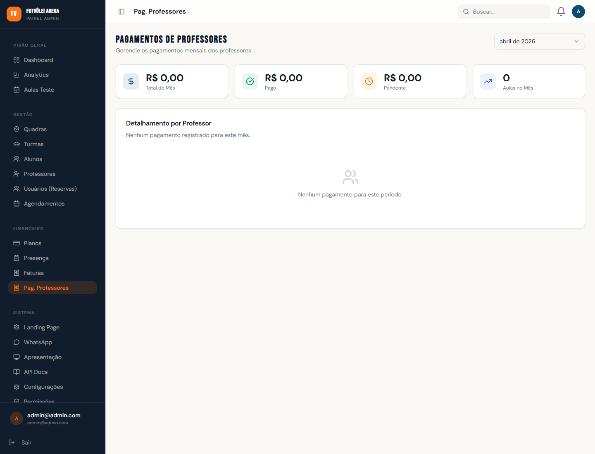

---

## 14. WhatsApp

### Para que serve
E a area de comunicacao com alunos, interessados e clientes.

### O que voce pode fazer aqui
- enviar mensagem individual
- enviar mensagem por turma
- usar templates prontos
- programar comunicacoes automaticas
- acompanhar historico

### Regra de negocio importante
O WhatsApp ajuda em tres frentes do negocio:
- relacionamento
- comparecimento
- cobranca

Quando bem usado, ele reduz faltas, melhora a conversao e ajuda a cobrar com mais agilidade.

### Quando usar
- diariamente para comunicacao ativa
- em cobrancas
- em confirmacao de aulas ou reservas

Imagem: Envio de mensagens

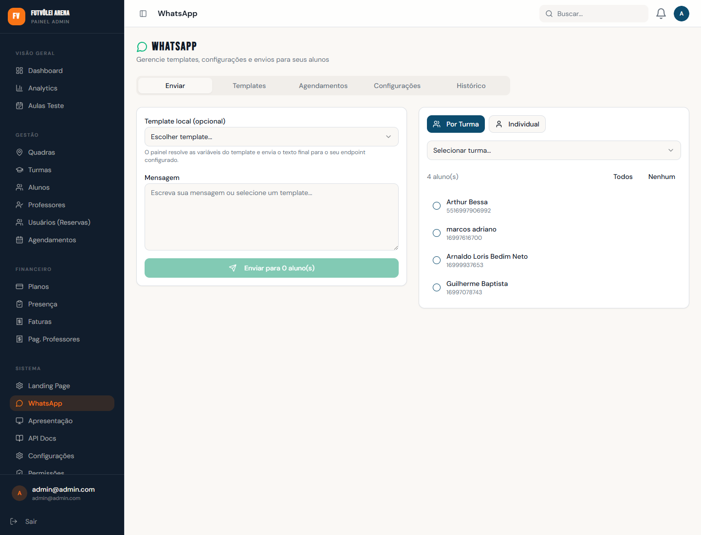

Imagem: Templates

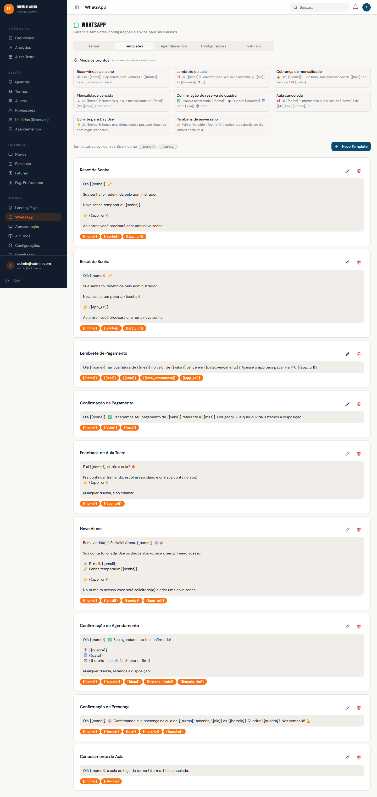

Imagem: Agendamentos automaticos

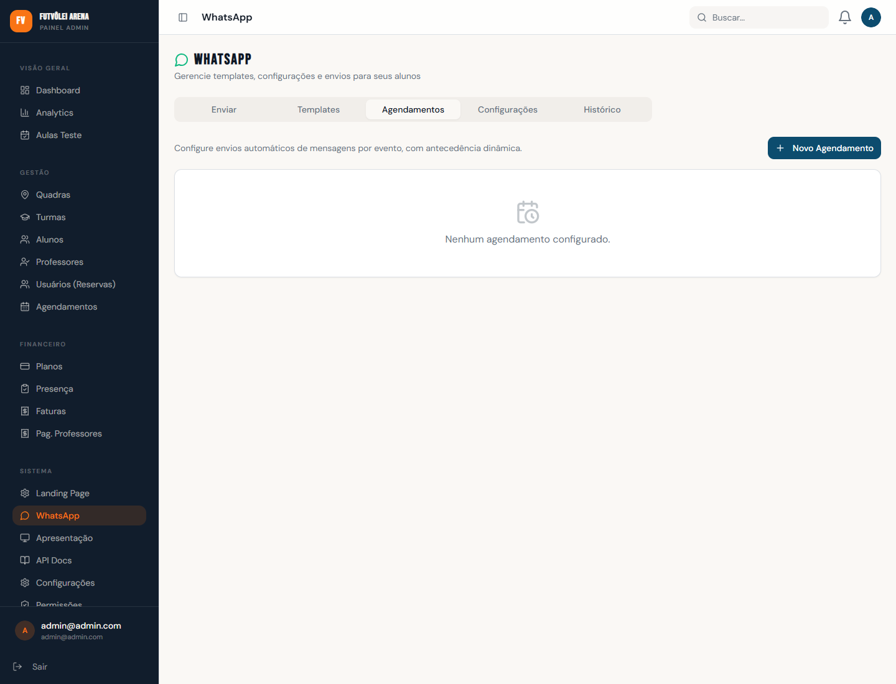

---

## 15. Analytics

### Para que serve
Essa e a area para olhar o negocio com mais estrategia.

### O que voce analisa aqui
- crescimento de alunos
- receita recebida e pendente
- presenca por turma
- ocupacao das quadras
- retencao de alunos
- churn

### Regra de negocio importante
Analytics nao e para olhar a toda hora.
E para parar, observar e decidir melhor.
Essa tela ajuda voce a responder perguntas como:
- qual turma esta forte e qual esta fraca
- qual horario tem melhor ocupacao
- onde esta a inadimplencia
- onde o negocio esta crescendo ou travando

### Quando usar
- semanalmente
- no fechamento do mes
- antes de tomar decisao comercial ou operacional importante

Imagem: Analytics

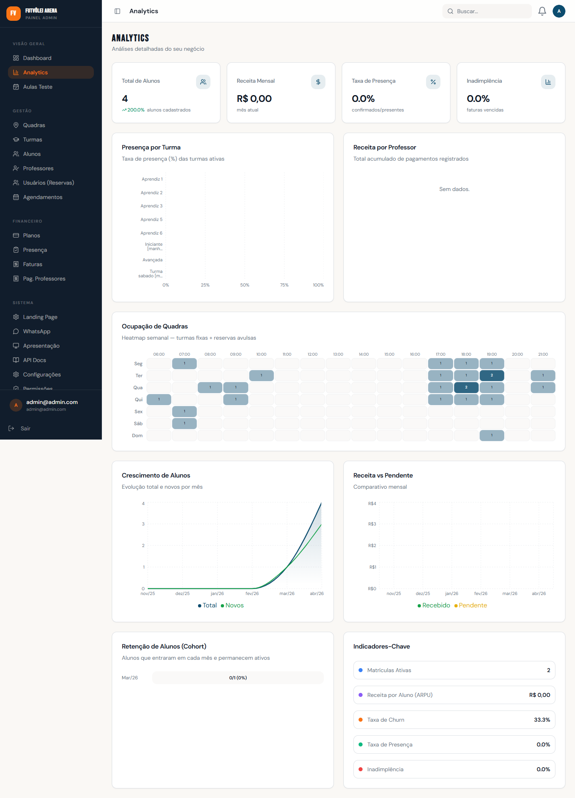

---

## 16. Permissoes e Usuarios do Sistema

### Para que serve
Essa area existe para quem divide a operacao com outras pessoas.

### O que voce controla aqui
- quem pode acessar o painel
- quais telas cada pessoa pode ver
- quem tem acesso total e quem tem acesso limitado

### Regra de negocio importante
Nem todo mundo precisa ver tudo.
Controlar permissao protege o negocio e evita erros operacionais.

### Quando usar
- quando entrar uma nova pessoa na equipe
- quando mudar responsabilidade de alguem
- quando for preciso remover acesso

Imagem: Permissoes

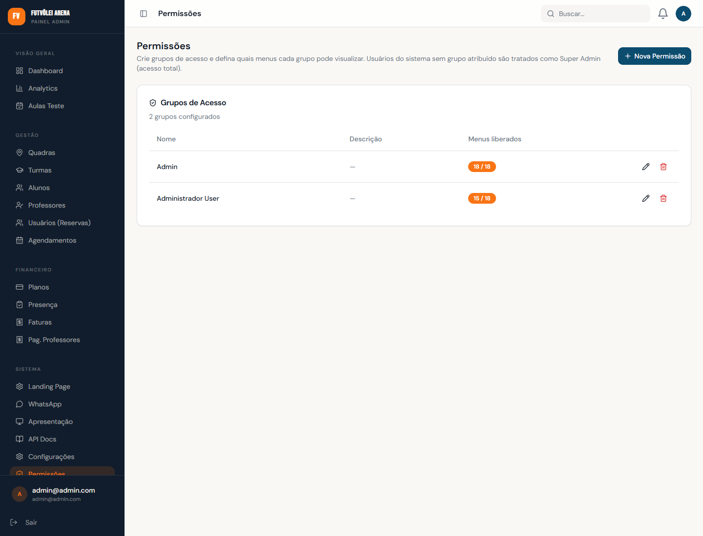

Imagem: Usuarios do sistema

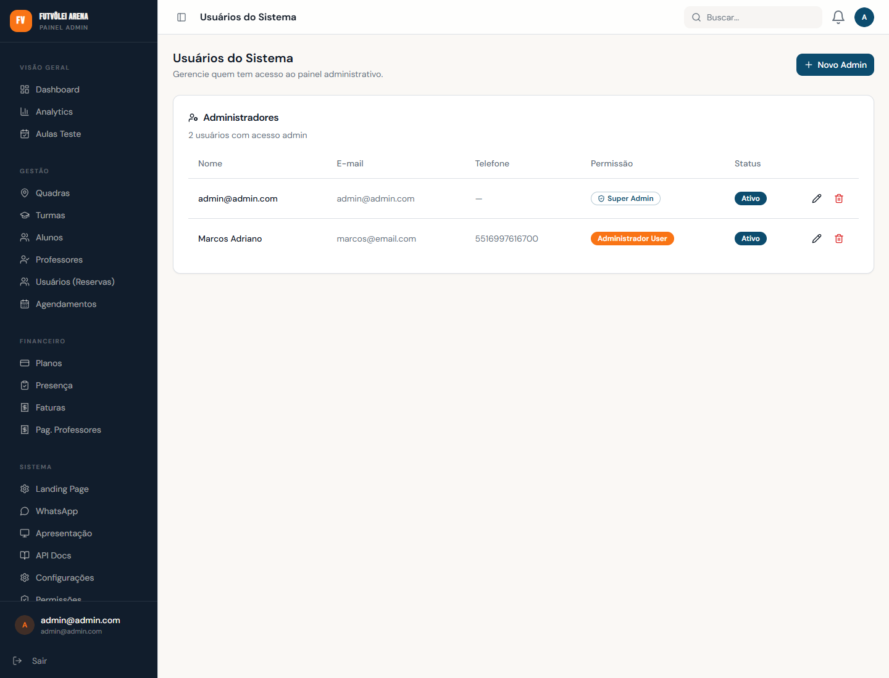

---

## Rotina recomendada do gestor

### Todo dia
- abrir o `Dashboard`
- verificar `Aulas Teste`
- conferir `Agendamentos`
- acompanhar `Presenca`
- olhar `Faturas` pendentes quando estiver em periodo de cobranca

### Toda semana
- revisar `Turmas`
- acompanhar faltas e lotacao
- usar `WhatsApp` para relacionamento e cobranca
- revisar `Analytics`

### Todo mes
- gerar e acompanhar `Faturas`
- revisar `Pagamentos de Professores`
- analisar crescimento, ocupacao e retencao
- atualizar `Landing Page` ou `Configuracoes` se algo do negocio mudou

---

## Em uma frase: como pensar o sistema

Se quiser resumir o sistema em linguagem simples, pense assim:

- `Dashboard` mostra o que esta acontecendo
- `Cadastros` organizam a operacao
- `Agendamentos` controlam a ocupacao
- `Faturas` controlam o dinheiro que entra
- `WhatsApp` ajuda a manter o cliente perto
- `Analytics` ajuda voce a decidir melhor

---

## Resumo final para quem nao e de TI

Voce nao precisa entender tecnologia para usar esse sistema.
O que importa e entender a logica do negocio:

1. organizar a estrutura
2. cadastrar corretamente as pessoas
3. acompanhar a agenda
4. cuidar da cobranca
5. manter contato com os clientes
6. olhar os resultados e ajustar a operacao

Se essas seis partes estiverem em ordem, o sistema passa a trabalhar a favor da sua gestao.
