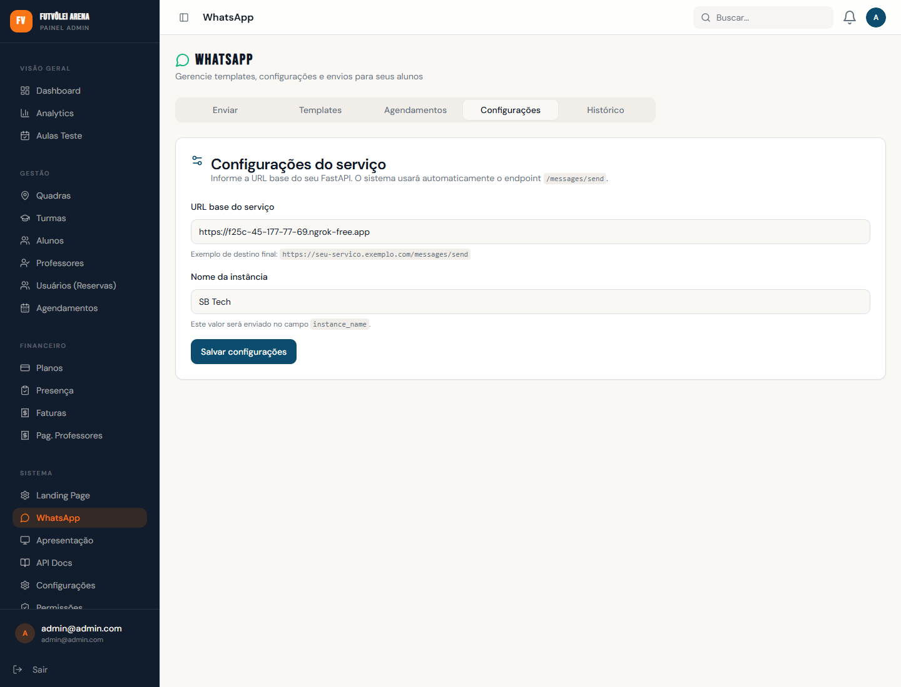

# Treinamento Admin - 1a Semana

Este guia foi pensado para um novo admin aprender o sistema na pratica, sem precisar decorar tudo no primeiro dia.
A ideia e simples: entender a base, operar a rotina e ganhar seguranca ao longo da primeira semana.

---

## Como usar este guia

- Leia por dia, nao por modulo.
- Execute cada tarefa no sistema antes de avancar.
- Use as imagens como apoio visual quando forem adicionadas.
- As imagens deste material ficam em `docs/images/admin/`.

> Observacao: se uma imagem ainda nao aparecer, basta salvar o screenshot com o nome indicado no arquivo `docs/images/admin/README.md`.

---

## Dia 1 - Entender a base do negocio

### Objetivo do dia
Configurar o que o sistema precisa para funcionar direito antes de cadastrar alunos ou operar agenda.

### Tela: Configuracoes
O que fazer:
- Preencher nome da empresa, logo e URL do app
- Definir preco de aluguel de quadra
- Definir preco de day use
- Definir percentual de sinal da reserva

Por que isso vem primeiro:
- A URL do app aparece em mensagens e links
- Os precos impactam reservas, day use e leituras do dashboard
- O sinal afeta a confirmacao de reservas

Impacto nas proximas telas:
- `Agendamentos` usa os valores configurados
- `WhatsApp` pode usar a URL do app nas mensagens
- `Dashboard` e `Analytics` passam a refletir esses dados com mais coerencia

Imagem esperada: Configuracoes > Identidade da Empresa

Imagem esperada: Configuracoes > Precos

### Tela: Landing Page
O que fazer:
- Conferir modo do negocio: aulas, aluguel ou ambos
- Ajustar imagem principal, CTA e links sociais
- Conferir horario de funcionamento

Por que isso importa:
- Essa e a porta de entrada publica do negocio
- O horario de funcionamento afeta a leitura da agenda
- O CTA influencia captacao de interessados

Impacto nas proximas telas:
- `Aulas Teste` recebe leads melhores quando a landing esta alinhada
- `Agendamentos` respeita melhor a operacao exibida

Imagem esperada: Landing Page > Configuracoes Gerais

### Tela: WhatsApp > Configuracoes
O que fazer:
- Preencher URL base do servico
- Informar nome da instancia
- Salvar

Por que isso importa:
- Sem essa etapa, o envio de mensagens pode falhar
- O sistema depende disso para automacoes e avisos

Impacto nas proximas telas:
- `Aulas Teste`, `Alunos` e envios manuais ficam mais completos

Imagem esperada: WhatsApp > Configuracoes

### Checklist do Dia 1
- Empresa configurada
- Precos configurados
- Landing revisada
- WhatsApp conectado

---

## Dia 2 - Montar a estrutura da operacao

### Objetivo do dia
Cadastrar a estrutura que sustenta as aulas: quadras, professores, planos e turmas.

### Tela: Quadras
O que fazer:
- Cadastrar cada quadra ativa
- Informar nome, local e tipo de piso, se desejar

Impacto nas proximas telas:
- `Turmas` precisam de quadra
- `Agendamentos` organiza a visualizacao por quadra

Imagem esperada: Lista de Quadras

Imagem esperada: Modal Nova Quadra

### Tela: Professores
O que fazer:
- Cadastrar professores com nome, email, senha e telefone
- Definir valor por aula

Impacto nas proximas telas:
- `Turmas` precisam de professor
- `Pagamentos de Professores` dependem desse valor
- Mensagens e aulas teste podem citar o professor

Imagem esperada: Lista de Professores

Imagem esperada: Modal Novo Professor

### Tela: Planos
O que fazer:
- Criar os planos de mensalidade
- Definir aulas por semana e valor mensal
- Ativar apenas os planos disponiveis para venda

Impacto nas proximas telas:
- `Alunos` podem ser cadastrados ja com plano
- `Faturas` usam esses valores
- O aluno tambem pode escolher o plano no portal quando aplicavel

Imagem esperada: Lista de Planos

Imagem esperada: Modal Novo Plano

### Tela: Turmas
O que fazer:
- Criar turmas com nivel, dias, horario, lotacao, quadra e professor
- Conferir se nome e horario estao claros

Impacto nas proximas telas:
- `Presenca` depende das turmas para gerar sessoes
- `Alunos` serao matriculados nelas
- `Agendamentos` passa a mostrar a ocupacao fixa

Imagem esperada: Lista de Turmas

Imagem esperada: Modal Nova Turma

### Checklist do Dia 2
- Quadras cadastradas
- Professores cadastrados
- Planos criados
- Turmas criadas

---

## Dia 3 - Cadastrar pessoas e entradas do negocio

### Objetivo do dia
Aprender a cadastrar alunos e tratar interessados que chegam por aula teste.

### Tela: Alunos
O que fazer:
- Criar um aluno novo
- Definir nivel, plano e turmas
- Conferir telefone e email

Ponto de atencao:
- Se o aluno tiver plano, ele entra no fluxo financeiro
- Se tiver telefone, entra no fluxo de WhatsApp
- Se estiver em turma, entra no fluxo de presenca

Impacto nas proximas telas:
- `Faturas` pode gerar cobranca para esse aluno
- `WhatsApp` pode enviar mensagens para ele
- `Presenca` vai considerar esse aluno nas sessoes

Imagem esperada: Tela de Alunos

Imagem esperada: Modal Novo Aluno

### Tela: Aulas Teste
O que fazer:
- Revisar solicitacoes pendentes
- Aprovar ou rejeitar
- Quando aprovada, confirmar os dados e enviar WhatsApp
- Quando realizada, marcar como `Realizada`

Impacto nas proximas telas:
- A aula teste concluida vira oportunidade real de cadastro em `Alunos`
- O WhatsApp ajuda na conversao

Imagem esperada: Aulas Teste com card pendente

Imagem esperada: Aulas Teste com status aprovada

### Checklist do Dia 3
- Pelo menos 1 aluno teste cadastrado
- Fluxo de aula teste entendido
- Aprovar, concluir e converter uma aula teste sem ajuda

---

## Dia 4 - Operacao diaria

### Objetivo do dia
Aprender a abrir o sistema, entender o dia e agir rapido.

### Tela: Dashboard
O que observar:
- Total de alunos
- Turmas ativas
- Receita total
- Day use do dia
- Proximas aulas

Como usar na pratica:
- Essa deve ser a primeira tela do dia
- Ela mostra para onde olhar em seguida

Impacto nas proximas telas:
- Normalmente leva voce para `Agendamentos`, `Presenca` e `Faturas`

Imagem esperada: Dashboard > Visao geral

### Tela: Agendamentos
O que fazer:
- Ver agenda semanal ou por quadra
- Identificar reservas pendentes, confirmadas e pagas
- Confirmar ou marcar pagamento quando necessario

Como pensar essa tela:
- Ela junta o que e aula fixa com o que e reserva avulsa
- E uma das telas mais importantes para o dia a dia

Impacto nas proximas telas:
- Afeta operacao real da quadra
- Alimenta leitura de ocupacao e receita

Imagem esperada: Agendamentos em modo semana

Imagem esperada: Agendamentos em modo por quadra

### Tela: Presenca
O que fazer:
- Gerar sessoes futuras
- Conferir sessoes criadas por turma
- Acompanhar confirmados, presentes e ausentes

Impacto nas proximas telas:
- `Analytics` usa esses dados para taxa de presenca
- Ajuda a acompanhar engajamento das turmas

Imagem esperada: Presenca com geracao de sessoes

### Checklist do Dia 4
- Abrir dashboard e explicar o que esta vendo
- Ler a agenda do dia com seguranca
- Gerar sessoes e entender a presenca

---

## Dia 5 - Financeiro basico

### Objetivo do dia
Entender como cobrar alunos e acompanhar pagamentos.

### Tela: Faturas
O que fazer:
- Ver faturas pendentes, pagas e vencidas
- Criar uma fatura manual
- Gerar em lote para alunos com plano
- Marcar uma fatura como paga

Como pensar essa tela:
- Ela e o centro da cobranca de mensalidade
- No inicio do mes, o foco costuma ser `Gerar em Lote`
- Durante o mes, o foco e acompanhar pendencias

Impacto nas proximas telas:
- `Dashboard` e `Analytics` passam a refletir receita recebida e pendente
- `WhatsApp` pode usar variaveis da fatura pendente

Imagem esperada: Lista de Faturas

Imagem esperada: Modal Gerar Faturas em Lote

### Tela: Pagamentos de Professores
O que fazer:
- Filtrar por mes
- Conferir valor total por professor
- Marcar como pago quando o repasse for realizado

Impacto nas proximas telas:
- Ajuda no fechamento financeiro do mes
- Aparece em parte das analises gerenciais

Imagem esperada: Pagamentos de Professores

### Checklist do Dia 5
- Entender diferenca entre pendente, pago e vencido
- Gerar faturas em lote
- Marcar uma fatura como paga
- Conferir pagamento de professor

---

## Dia 6 - Comunicacao com alunos

### Objetivo do dia
Aprender a enviar mensagens sem depender de processos manuais fora do sistema.

### Tela: WhatsApp > Enviar
O que fazer:
- Enviar mensagem por turma
- Enviar mensagem individual
- Testar um template
- Ver a pre-visualizacao antes do envio

Impacto nas proximas telas:
- Apoia cobranca, lembrete e relacionamento
- Usa dados de `Turmas`, `Alunos` e `Faturas`

Imagem esperada: WhatsApp > Enviar

### Tela: WhatsApp > Templates
O que fazer:
- Criar um template de boas-vindas
- Criar um template de cobranca ou lembrete

Impacto nas proximas telas:
- Acelera envios manuais e automacoes

Imagem esperada: WhatsApp > Templates

### Tela: WhatsApp > Agendamentos
O que fazer:
- Revisar mensagens automaticas configuradas
- Entender gatilho, template e dias antes do evento

Impacto nas proximas telas:
- Reduz esquecimentos e melhora rotina comercial/financeira

Imagem esperada: WhatsApp > Agendamentos

### Checklist do Dia 6
- Enviar mensagem teste com seguranca
- Entender templates
- Entender automacoes

---

## Dia 7 - Leitura do negocio e acessos

### Objetivo do dia
Fechar a primeira semana entendendo como acompanhar resultados e como controlar acessos da equipe.

### Tela: Analytics
O que observar:
- Crescimento de alunos
- Receita recebida vs pendente
- Presenca por turma
- Ocupacao de quadras
- Retencao e churn

Como usar na pratica:
- Nao e uma tela para toda hora
- Ela serve para leitura semanal e tomada de decisao

Imagem esperada: Analytics

### Tela: Permissoes
O que fazer:
- Entender grupos de acesso
- Ver quais menus cada perfil pode enxergar

Imagem esperada: Permissoes

### Tela: Usuarios do Sistema
O que fazer:
- Criar novos admins
- Atribuir permissao correta
- Evitar dar acesso total sem necessidade

Impacto nas proximas telas:
- Organiza a operacao em equipe com menos risco

Imagem esperada: Usuarios do Sistema

### Checklist do Dia 7
- Ler os indicadores principais
- Entender quem pode acessar o que
- Saber criar ou editar um admin

---

## Rotina recomendada depois da 1a semana

Toda manha:
- Abrir `Dashboard`
- Revisar `Aulas Teste`
- Conferir `Agendamentos`
- Conferir `Presenca`

Ao longo da semana:
- Atualizar `Alunos`
- Enviar mensagens pelo `WhatsApp`
- Acompanhar `Faturas`

No fechamento semanal ou mensal:
- Revisar `Analytics`
- Conferir `Pagamentos de Professores`
- Ajustar `Landing Page` e `Configuracoes` se necessario

---

## Resumo rapido para o novo admin

Se lembrar so de uma ordem, use esta:

1. Configurar base
2. Criar estrutura
3. Cadastrar alunos
4. Operar agenda e presenca
5. Cobrar e comunicar
6. Analisar resultados
